# Fork: information architecture

How Fork is organised for the person using it: the places in the app, what each is for, how you get there, and the words Fork uses. It sits next to [TECHNICAL.md](TECHNICAL.md) (how it's built) and [states-and-flows.md](states-and-flows.md) (what a terminal can be doing, and the flows through it).

This describes the **redesign** (`ui-redesign` branch). Where the released app differs, it says so.

**Keep it current.** Any change that adds, moves, renames or removes a place, a tab, a setting or a shortcut updates this doc in the same commit. `npm run check` fails if a ⌘P panel tab or a settings page is missing here. Add a dated line to the [log](#log) at the bottom.

---

## 1. The mental model

```
Window
└── Workspaces: one per project folder, as tabs along the top
    └── Terminals: one or more side by side, all in that folder
        (an AI agent like Claude runs inside a terminal)
Around them, for the open workspace:
    Sidebar (left):  search, workspace info, files
    Panel (right, ⌘P): File · App · Changes · Design · Read
```

- **A workspace is a folder.** Its name, info, files, search, Changes and Design all belong to that folder, wherever its terminals `cd` to. A window always has at least one workspace; closing the last one brings back New workspace's three cards, which can't be closed.
- **A terminal is a place to type**, and where agents work. Each has a name chip ("Terminal 1", double-click to rename).
- **The panel shows things next to your terminals** without leaving them: a file, your running app, what an agent changed, the project's design system, a book.

## 2. Map

```mermaid
flowchart TB
  W[Fork window]
  W --> TS[Top strip]
  W --> SB[Sidebar]
  W --> T[Terminals]
  W --> P[Panel ⌘P]
  W --> OV[Overlays]
  W --> ST[Settings ⌘,]
  TS --> TS1[Workspace tabs ⌘1–9]
  TS --> TS2[+ New workspace ⌘N]
  TS --> TS3[Update pill]
  TS --> TS4[Split right ⌘D · Split down ⌘⇧D · Panel ⌘P]
  SB --> SB1[Search ⌘K]
  SB --> SB2[Workspace info]
  SB --> SB3[Files]
  SB --> SB4["Footer: What's new · Settings · Help"]
  T --> T1[Terminal chips]
  T --> T2[Notes: What went wrong?]
  T --> T3[Find bar ⌘F]
  T --> T4[Game pane]
  P --> P1[File]
  P --> P2[App]
  P --> P3[Changes]
  P --> P4[Design]
  P --> P5[Read]
  OV --> OV1[New workspace: quick search box, or three cards]
  OV --> OV2[Command palette ⌘⇧K]
  OV --> OV3[Welcome + tour]
  OV --> OV4[What's new / update]
  ST --> ST1[Appearance]
  ST --> ST2[General]
  ST --> ST3[Notifications]
  ST --> ST4[Privacy]
  W -. while you're in another app .-> OUT[Notch · Mac notifications · Dock badge]
```



## 3. Each place

### Top strip
36px tall: the traffic lights, tabs and buttons on one line, each tab 4px above the card.

| Element | For | Get there | Notes |
|---|---|---|---|
| Workspace tabs | Switching projects | Click, ⌘1–9, ⌘⇧[ / ⌘⇧]; double-click or ⌘R to rename | Named after its folder until you rename it (an empty name goes back to the folder's). The square is the status: solid = ready, rippling lattice = working, yellow pulse = needs you or finished while you were away, red = failed. × closes the workspace. |
| + | Opening another workspace | ⌘N | Opens New workspace's quick search box. |
| Update pill | A new Fork is ready | Appears by itself | Click to restart into it. |
| Split right / down | Another terminal beside or below this one | ⌘D / ⌘⇧D | ⌘T adds one more terminal as a new column on the right. |
| Panel button | Opening the right panel | ⌘P | A yellow dot means there's a new before/after in Changes. |

### Sidebar (⌘B hides it)
| Section | For | Notes |
|---|---|---|
| Search | Finding files by name, and lines inside them | ⌘K. Results replace the sidebar until Esc. A hit opens in File, at its line. |
| Workspace info | Branch, what's changed (+/−, files), the app it's serving | Each line only when there is one. Click the app's address to see it (in the side panel, or the browser if Links & files is off). |
| Files | The folder's tree, with git badges | Clicking a file opens it in File; clicking a folder opens it in place (never `cd`s). Right-click: preview, open in your editor, Finder, copy path, put path in terminal, open in terminal. + makes a new file. Drag a file onto a terminal to type its path. In the Home workspace it shows a way into a project instead. |
| Footer | What's new · Settings · Help (the tour) | |

### Terminals
| Element | For | Notes |
|---|---|---|
| Terminal chip | Its name and whether an agent is open | "Terminal N" until an agent works in it: then the task it's on (Claude, OpenCode), kept after it quits, or the agent's name while it's open (Codex, Gemini). Icon switches to a sparkle when an agent is open. Double-click or ⌥⌘R to rename; a name you type always wins, and an empty one turns the task names back on. × closes. |
| Notes under the terminals | "That didn't work · What went wrong?" | Only when there's something to say. What went wrong explains in plain words and can type a fix (never runs it), or Ask AI. |
| Find bar | Finding text in the terminal | ⌘F, ⌘G / ⌘⇧G. |
| Game pane | Snake, Stack, Space Run while you wait | From the command palette. Opens as a split beside the terminal (or its own tab if there's no room). |
| Parked for now | ← → folder history, suggestion chips, the running bar (Stop, Play a game), breadcrumbs | They still work in code but aren't shown in the redesign yet. |

### Panel (⌘P)
One panel on the right with tabs. Its width is dragged from its left edge.

| Tab | For | What's in it |
|---|---|---|
| **File** | Reading a file without leaving the terminal | Code (coloured, line numbers; select lines → "Put file:12-20 in terminal"), Markdown, images, video. Open in your editor or Finder. Read-only by design. |
| **App** | Your running app, beside the terminal | Back, forward, reload, address bar (just "3000" works), open in your browser. Follows a dev server when it starts. |
| **Changes** | Seeing what an agent's turn did to your app | Before and after pictures, side by side or with a slider; the files it changed (click to open in File); a strip of earlier turns. Pin keeps a pair; Delete removes it; ↗ shows the page in App. Taken automatically while an app is running; off in Settings → General. |
| **Design** | The project's design system at a glance | Colours (default and dark side by side), type, spacing, radius, shadows, motion, read from the project's own files and updated as they change. Click copies the token, ⇧-click puts it in the terminal, ⌥-click opens where it's set. |
| **Read** | A book while an agent works | PDF or EPUB, Pages or Scroll, remembers your place; says when the agent is done. |

### Overlays
| Overlay | For | Get there |
|---|---|---|
| New workspace | Choosing a folder to work in | **Quick search box** (⌘N, +): one box. Type a name → Create it (in the usual place) or Put it somewhere else…; a recent folder with that name comes first as Open. Paste a project link → Get it from GitHub. Empty: Recent (and Home), then New folder, Choose a folder…, Get a project from GitHub. ↑↓ move, ↵ open, Esc close. **Three cards** (first run, a new window, closing the last workspace; can't be closed): New folder, Choose a folder…, From GitHub, each with a line picture that answers your pointer; New folder and From GitHub open a box under the cards ("in ~/Code", click to change). Recent underneath, and the anonymous-usage line with Turn off. |
| Command palette | Plain-English commands, Ask AI, games | ⌘⇧K. Types the real command for you to run. |
| Welcome cards + tour | First run | Once; again from Help or Settings → General. |
| What's new / update | Release notes; restarting into an update | After an update; the footer's gift; Fork menu → Check for Updates…. |

### Settings (⌘,)
| Page | What's on it |
|---|---|
| **Appearance** | Light / Dark / System, font, font size, font smoothing, translucent frame, a preview. |
| **General** | Open links and files inside Fork; Before and after pictures of your app; Reopen your tabs when Fork starts; Welcome tour. |
| **Notifications** | Tell me when something's done; Play a sound when something finishes; Show what's happening in the notch (Macs with a notch). |
| **Privacy** | Share anonymous usage; Smarter matching. |

### Outside the window
While Fork isn't in front: the **notch** (on a Mac with one) grows to show what's working, done or failed, and you can hover it to see every tab. Otherwise a **Mac notification**. Either way the **Dock badge** counts what happened. Clicking any of them goes to that terminal.

## 4. Shortcuts
| Keys | Does |
|---|---|
| ⌘N | New workspace (the quick search box) |
| ⌘T | New terminal in this workspace |
| ⌘R | Rename this workspace |
| ⌥⌘R | Rename this terminal |
| ⌘⇧N | New window |
| ⌘W | Close the terminal (the window, if no workspace is left) |
| ⌘D / ⌘⇧D | Split right / down |
| ⌘⌥ + arrows | Move between terminals |
| ⌘1–9, ⌘⇧[ / ⌘⇧] | Go to a workspace / previous / next |
| ⌘K | Search files |
| ⌘⇧K | Command palette |
| ⌘F, ⌘G, ⌘⇧G | Find in the terminal, next, previous |
| ⌘[ / ⌘] | Back / forward through folders |
| ⌘B | Show or hide the sidebar |
| ⌘P | Show or hide the panel |
| ⌘, | Settings |
| ⌘⇧R | Reload Fork (keeps your tabs) |
| Hold ⌘ | Shows each button's shortcut |
| ⇧↩ | A new line instead of sending (for agents) |
| Esc | Closes an overlay; in an agent, stops it |

## 5. Words Fork uses
| Word | Means | Not |
|---|---|---|
| Fork | The app, always | "designer-terminal" (internal package name only) |
| Workspace | A project folder open in a tab | project tab, session |
| Terminal | One place to type, inside a workspace | pane, shell (in UI copy) |
| Agent | An AI tool working in a terminal (Claude, Codex, OpenCode, Gemini) | bot, assistant. Name the tool when it's known; never favour one in general copy. |
| Turn | One stretch of an agent working, from starting to waiting for you | run, job |
| Panel | The right side with File, App, Changes, Design, Read | preview pane, drawer |
| Your app | What the project serves on localhost | site, server |
| Before and after | The two pictures around a turn | diff, screenshot comparison |
| Token | A named design value (`--brand`, `text-xl`) | variable (fine in technical copy) |
| Needs you / Done / Failed / Working | Terminal states (see states-and-flows.md) | |

## 6. Open IA questions
- **Changes and Design**: in the panel for now. Do they stay there, become their own place, or join a per-workspace view?
- **Parked controls** (folder history, suggestion chips, Stop / Play a game): where do they go in the redesign, or do they go?
- **Changes outside Fork**: should "Claude's done" in the notch or a notification open Changes directly?
- **Design across projects**: one design system per workspace, or a shared one (e.g. a design-system repo) pinned beside every workspace?
- See states-and-flows.md for the open questions on states.

---

## Log
- **9 Oct 2026**: The workspace picker is now New workspace, with two faces: a quick search box for ⌘N and +, and three picture cards when no workspace is open (first run, closing the last one).
- **9 Oct 2026**: Workspaces can be renamed (double-click the tab, ⌘R). Terminal chips show the task the agent is working on, or the agent's name, unless you named the terminal (double-click, ⌥⌘R).
- **9 Oct 2026**: The "Your app is running at … · Show it" bar under the terminals is gone, and so is the notch's "Ready". The app's address in Workspace info is the one place it shows; click it to see the app.
- **9 Oct 2026**: The top strip is 36px (was 44), so a workspace tab sits 4px above the card (was 8) and reads as part of it. `--strip` in index.html; the traffic lights follow (main.js).
- **7 Oct 2026**: First version, covering all of Fork on `ui-redesign`, including the new Changes and Design tabs in the panel and the Before and after setting.
