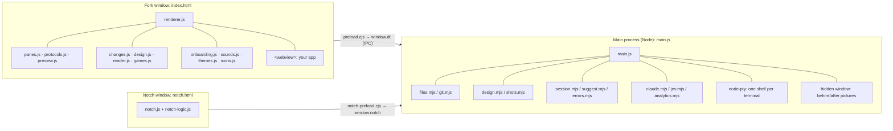

# Fork: how it's built

The technical map of Fork: its parts, how they talk, the libraries it uses, what it stores and how the tricky bits work. It sits next to [IA.md](IA.md) (how Fork is organised for the person using it) and [states-and-flows.md](states-and-flows.md) (terminal states and flows for the redesign).

**Keep it current.** Any change that adds or changes a file, an IPC call, a library, something Fork stores, or how a feature works updates this doc in the same commit. `npm run check` fails when a file, a library or a `dt.*` call is missing from it. Add a dated line to the [log](#log) at the bottom.

---

## 1. The shape of it

Fork is an Electron app: a terminal for designers who work with AI agents. There's no front-end framework and no bundler for Fork's own code. The window is `index.html` plus plain `<script>` files, each one owning a part of the screen and exposing a `window.X` object. Only third-party libraries that need it are bundled, into `vendor/`.

- **Main process** (`main.js`, ES modules): windows, the menu, shells (node-pty), files, git, updates, notifications, the notch, session saving, analytics, and anything that touches the disk or the network.
- **Preload** (`preload.cjs`): the only bridge. It exposes `window.dt`, a list of named calls that map to IPC channels (see [IPC](#4-ipc-every-dt-call)). The window never gets Node.
- **Window** (`index.html` + scripts): everything you see. `renderer.js` is the conductor; the other scripts are self-contained parts it sets up.
- **Notch window** (`notch.html`): a see-through panel over the MacBook notch that shows what your terminals are doing while you're in another app.
- **Hidden picture window**: one `show: false` window, created on first use, that loads your app to take before/after pictures. It's never counted as a Fork window (`forkWindows()` leaves it out).
- **Your app** shows in a sandboxed `<webview>` (partition `persist:preview`, no Node, no preload).

## 2. File map

Names move less than line numbers, so the docs point at files and function names.

### Main process
| File | What it owns |
|---|---|
| `main.js` | Windows, menu and shortcuts, ptys, every IPC handler, the notch window, notifications, session saving, updates, analytics wiring, the hidden picture window. |
| `files.mjs` | The Files tree (`list`), the preview (`readPreview`), books (`readBook`), finding your code editor, search (`searchFiles`), `projectFiles`, New folder (`makeFolder`). |
| `git.mjs` | Parses `git status` for the Workspace info line (`gitInfo`) and the Files tree's badges (`gitFiles`). |
| `design.mjs` | The Design tab: finds token files (`tokenFiles`), reads CSS/SCSS variables, Tailwind and token JSON without running anything (`tokensFrom`), and caches scans (`scanDesign`). |
| `shots.mjs` | Before/after storage: `shotStore` (pictures + index.json per folder, 20 kept + pinned), `changedFiles`, `isFrontend`. |
| `session.mjs` | Reopening the way you left it: `clean()` validates session.json so a damaged file can't stop Fork starting. |
| `suggest.mjs` | The suggestion chips and the ⌘⇧K palette presets (`suggest`, `PALETTE`). |
| `errors.mjs` | "What went wrong?": Fork's own library of common errors, explanations and fixes (`diagnose`). |
| `jev.mjs` | Jev (TypeSafe) questions: which ⌘K preset a request means, which known error this is. Only when you act, and only with Smarter matching on. |
| `claude.mjs` | Ask AI: one warm Claude Code (Haiku) session using your own login. |
| `analytics.mjs` | Anonymous usage to PostHog, allow-listed values only. |
| `version.mjs` | Comparing version numbers (update pill, release script). |
| `preload.cjs` | `window.dt`, the window's only way to main. |
| `notch-preload.cjs` | `window.notch`, the notch window's only way to main. |

### Window scripts (loaded in this order by `index.html`)
| File | What it owns |
|---|---|
| `vendor/trees.js` | @pierre/trees bundled as `window.Trees` (the Files tree). |
| `panes.js` | The split-pane tree: `split`, `append`, `remove`, `leaves`, `neighbor`. Pure. |
| `icons/central/ready.js` | Central Icons, when drawn on this Mac (`npm run icons`); git-ignored. |
| `icons.js` | Lucide icons (`icon()`), file-type icons (`fileIcon`, `phFile`). |
| `preview.js` | Text helpers: `stripAnsi`, `findLocalUrl` (spots a dev server's address), `dropText`. Pure. |
| `protocols.js` | What terminal apps ask of Fork (OSC 9/99/777/52) and which AI agent is open and working (`AGENTS`, `claudeTitle`, `interruptHint`). Pure. |
| `themes.js` | The terminal's dark and light looks (`window.THEMES`). |
| `onboarding.js` | Welcome cards and the spotlight tour. |
| `games.js` | Snake, Stack and Space Run in a pane. |
| `reader.js` | The Read tab: PDF and EPUB. |
| `changes.js` | The Changes tab: before/after pictures, slider, files, timeline. |
| `design.js` | The Design tab: draws the tokens, re-reads every 4 s while visible. |
| `sounds.js` | The done chime, synthesised with Web Audio. |
| `renderer.js` | Everything else: tabs and panes, xterm, the sidebar, search, the ⌘P panel, turns, the palette, settings, the session. |
| `notch-logic.js`, `notch.js`, `notch.html` | The notch's rules (pure) and drawing. |
| `index.html` | The markup, and all CSS (tokens in `:root`, light mode under `:root[data-mode="light"]`). |
| `colors.css` | The redesign's Figma palette as `--c-<hex>` and Figma names. |

### Everything else
| Path | What it is |
|---|---|
| `check.mjs` | `npm run check`: the test suite (plain `node:assert`), including the doc checks. |
| `shell/` | `.zshrc`, `.zprofile`, `.zshenv`: load your own config, then add folder reporting (OSC 7) and command start/end (OSC 133). |
| `scripts/vendor.mjs` | Bundles @pierre/trees and @pierre/diffs into `vendor/` (runs on `npm install`). |
| `scripts/icons.mjs` | Draws Central Icons into `icons/central/` from your licence key. |
| `scripts/release.mjs`, `install-app.sh` | Releasing (see RELEASING.md) and installing a local build. |
| `scripts/posthog-dashboard.mjs`, `dashboard-charts.mjs`, `website-dashboard-charts.mjs` | The PostHog dashboards, kept in sync with the events Fork sends. |
| `build/` | App icon, DMG background, entitlements. |
| `icons/` | `ph/` Phosphor SVGs (committed), `central.json` (names only), `central/` (git-ignored, paid). |
| `vendor/` | Bundled third-party code. `vendor/diffs/` is git-ignored and rebuilt. |
| `docs/` | This doc, IA.md, states-and-flows.md, files-and-code-next.md. |

## 3. Libraries

Every package in `package.json`, plus what Fork uses that isn't an npm package. `npm run check` fails if a package is missing from this table.

### In the app (dependencies)
| Library | Version | What Fork uses it for | Where | Licence |
|---|---|---|---|---|
| `@xterm/xterm` | 6.0.0 | The terminal itself | window | MIT |
| `@xterm/addon-fit` | 0.11.0 | Sizes the terminal to its pane | window | MIT |
| `@xterm/addon-webgl` | 0.19.0 | GPU text drawing (falls back to DOM) | window | MIT |
| `@xterm/addon-search` | 0.16.0 | ⌘F find in the terminal | window | MIT |
| `@xterm/addon-serialize` | 0.14.0 | Saves each screen for session restore | window | MIT |
| `@xterm/addon-web-links` | 0.12.0 | ⌘-click web addresses | window | MIT |
| `@xterm/addon-image` | 0.9.0 | Pictures apps draw in the terminal (Sixel, iTerm) | window | MIT |
| `node-pty` | 1.1.0 | One real zsh per terminal | main | MIT |
| `electron-updater` | 6.8.9 | Downloads and installs updates from GitHub releases | main | MIT |
| `marked` | 18.0.14 | Markdown to HTML (previews, release notes) | main | MIT |
| `dompurify` | 3.4.16 | Cleans Markdown HTML before it's shown | window | MPL-2.0 or Apache-2.0 |
| `pdfjs-dist` | 6.3.289 | Read: PDFs (loaded on first book) | window | Apache-2.0 |
| `epubjs` | 0.3.93 | Read: EPUBs | window | BSD-2-Clause |
| `jszip` | 3.10.2 | Unzips EPUBs for epubjs | window | MIT or GPL-3.0 |
| `@fontsource-variable/inter` | 5.3.0 | The UI font | window | OFL-1.1 |
| `@fontsource/ibm-plex-mono` | 5.3.0 | Default terminal font, mono labels | window | OFL-1.1 |
| `@fontsource/fira-code` | 5.3.0 | Terminal font choice | window | OFL-1.1 |
| `@fontsource/geist-mono` | 5.3.0 | Terminal font choice | window | OFL-1.1 |
| `@fontsource/jetbrains-mono` | 5.3.0 | Terminal font choice | window | OFL-1.1 |

### For building (devDependencies)
| Library | Version | What Fork uses it for | Licence |
|---|---|---|---|
| `electron` | 41.10.7 | The app runtime | MIT |
| `electron-builder` | 26.15.3 | Builds, signs and packages Fork.app and the DMG | MIT |
| `esbuild` | 0.28.2 | Bundles Pierre's libraries into `vendor/` | MIT |
| `@pierre/trees` | 1.0.0-beta.6 (pinned) | The Files tree; bundled to `vendor/trees.js` | Apache-2.0 |
| `@pierre/diffs` | 1.5.2 (pinned) | The code preview, coloured in a worker; bundled to `vendor/diffs/` | Apache-2.0 |
| `shiki` | 4.4.3 | The grammars and themes @pierre/diffs colours code with | MIT |
| `motion` | 13.4.0 | **Not used anywhere.** Added in 0.1.0; a candidate to remove | MIT |

### Not from npm
| What | Used for | Notes |
|---|---|---|
| Central Icons (round-outlined, radius 2, stroke 1.5) | The redesign's icons | Paid. Only names are committed (`icons/central.json`); SVGs are drawn on your Mac by `npm run icons` and never published (not in the repo, the website or an Artifact). |
| Phosphor icons | Fallback for the redesign's icons | `icons/ph/`, MIT. |
| Lucide icons | Older UI icons | Inlined in `icons.js`, ISC. |
| Jev (TypeSafe), via fork-website `/api/jev` | Smarter matching in ⌘K and errors | The key lives only in Vercel, never in the app. |
| Claude Code (your own install) | Ask AI | Uses the person's login; nothing runs until they press Ask AI. |
| PostHog | Anonymous usage | See DISTRIBUTION.md and analytics.mjs. |

## 4. IPC: every `dt` call

The window calls `window.dt.<name>(…)`; `preload.cjs` maps each to a channel; `main.js` handles it. `invoke` waits for an answer, `send` doesn't, `on` listens. `npm run check` fails if a `dt` call is missing here.

| Group | Calls (channel) |
|---|---|
| Terminals | `create` (pty:create), `write` (pty:write), `resize` (pty:resize), `kill` (pty:kill), `onData` (pty:data), `onExit` (pty:exit), `onCmd` (cmd: a menu shortcut) |
| Files and git | `dir` (dir: entries + suggestions + home), `ls` (ls), `entryMenu` (entry:menu), `gitInfo` (git:info), `gitFiles` (git:files), `watch` (watch), `onFsChanged` (fs:changed), `searchFiles` (files:search), `pathOf` (local: a file dropped from Finder) |
| Preview and opening | `preview` (preview), `editor` (editor), `openIn` (open-in), `reveal` (reveal), `openExternal` (open-external), `openDefault` (open-default), `clipWrite` (clip:write) |
| Before and after | `turnStart` (turn:start), `turnFinish` (turn:finish), `turnDrop` (turn:drop), `turns` (turns:list), `turnPin` (turns:pin), `turnRemove` (turns:remove) |
| Design | `designScan` (design:scan) |
| Books | `readBook` (book:read), `pickBook` (book:pick) |
| Workspaces | `pickFolder` (pick-folder), `recents` (recents), `makeFolder` (folder:create), `home` (home) |
| Notifications and notch | `notify` (notify), `onGoPane` (go-pane), `notchState` (notch:state), `notchSetting` (notch:setting) |
| ⌘K, errors and AI | `palette` (palette), `paletteMatch` (palette:match), `ask` (ask), `aiWarm` (ai:warm), `explain` (explain), `explainAI` (explain:ai) |
| Appearance | `appearance` (appearance) |
| Updates | `version` (version), `updateCheck` (update:check), `updateCheckNow` (update:check-now), `updateNotes` (update:notes), `updateInstall` (update:install), `onUpdateReady` (update:ready) |
| Session | `sessionStart` (session:start), `sessionSave` (session:save), `sessionForget` (session:forget), `sessionEnabled` (session:enabled), `onSessionCollect` (session:collect) |
| Analytics | `track` (track), `analytics` (analytics) |

The notch window has its own four: `notch.onState`, `notch.onMoment`, `notch.mouse`, `notch.go` (notch-preload.cjs).

## 5. What Fork keeps on your Mac

In the app's data folder (`~/Library/Application Support/designer-terminal`, or `FORK_DATA_DIR` when testing):

| File | Holds | Notes |
|---|---|---|
| `session.json` | Each window's tabs, splits, folders and screens | Owner-only (0600): it can hold terminal output. |
| `recents.json` | The last 6 folders you opened | |
| `analytics.json` | The random install ID and the on/off switch | |
| `shots/<folder hash>/` | Before/after PNGs and `index.json` per workspace | 20 turns per folder plus pinned ones; strays older than 12 h are swept. |

In the window's localStorage:

| Key | Holds |
|---|---|
| `dt-settings` | Every setting (appearance, font, switches: `inFork`, `shots`, `alerts`, `sounds`, `showNotch`, `smart`…) |
| `dt-books` | Read: recent books, your place in each, Pages or Scroll |
| `dt-onboarded` | The welcome cards were seen |
| `dt-seen-version`, `dt-notes-read` | Which version's "What's new" you've seen |
| `dt-new-parent` | Where New folder last made a folder |
| `dt-changes-mode` | Changes: Side by side or Slider |

## 6. How things work

### Commands, folders and agents
- `shell/.zshrc` makes zsh report its folder (OSC 7) and each command's start and end (OSC 133 C/D, with the exit code). `renderer.js newPane` listens: start sets `pane.busy`, end sets `failed`, clears `pane.url` and calls `workDone`.
- **Which agent is open**: the command's first word (`pane.tool`) or the title it sets (`Protocols.agentFromTitle`), looked up in `Protocols.AGENTS` (Claude, OpenCode, Codex, Gemini).
- **Is it working**: Claude's title starts with a spinner while working and ✳ while waiting (`claudeTitle`); the others show "esc to interrupt" only while working (`interruptHint`, read from the bottom lines by `checkHint`). Both feed `setThinking(pane, on)`, the single "turn started / turn ended" moment. It drives the tab square, the notch, the chime, `workDone`, and before/after.

### Your app
- `dt.onData` keeps the last 400 characters of each terminal's output; `Preview.findLocalUrl` spots `http://localhost:PORT` and `appFound` offers it ("Your app is ready"), sets `pane.url` and shows it in Workspace info.
- The App tab is a `<webview>`; main strips its preload and forces sandboxing (`will-attach-webview`), and pop-ups go to your browser.

### Before and after (Changes tab)
1. `setThinking(pane, true)` → `turnStarted`: picks the URL (`appUrlOf`: the App tab's page if it's this workspace's app, else the workspace's dev server) and calls `turn:start`.
2. Main takes the **before** picture in the hidden window: loads the URL, turns animations and transitions off so identical pages give identical pictures, waits for fonts plus 700 ms, then a full-page PNG through the Chrome DevTools Protocol (`Page.captureScreenshot`, 1280 wide, up to 4000 tall), then goes back to `about:blank`. Pictures are queued one at a time. It also snapshots `git status` plus each changed file's mtime and size (`snapOf`).
3. `setThinking(pane, false)` (or the agent quitting) → `turnEnded` → after 1.5 s, `turn:finish`: snapshot again; `changedFiles` + `isFrontend` decide whether a file you can see changed. No: the before is deleted. Yes: the **after** picture; if its hash equals the before's, both are deleted; otherwise `shots.add` keeps the turn.
4. `Changes.added` shows it, or a dot appears on Changes (and on the panel button). Settings → General → "Before and after pictures" (`settings.shots`) turns it all off.

### Design tab
- `design:scan` → `scanDesign`: lists the project's files (`projectFiles`: git, or a capped walk), keeps likely token files (`tokenFiles`), and returns the cached result when no file's mtime or size changed.
- `tokensFrom`: a small CSS scanner (`cssDecls`) finds `--name: value` and `$name: value` with the selectors around them. `themeOf` keeps only theme-level ones (`:root`, `html`, `@theme`, `.dark`, `[data-theme=x]`, `prefers-color-scheme`) and skips component variables and breakpoints. Tailwind v3 configs and theme files are read with a literal-only reader (`literal`) that skips functions, variables and spreads: project code is never run. `var()`, `$x` and `{a.b}` references resolve per theme, and `classify` sorts each token into colour, type, spacing, radius, shadow, motion or other.
- `design.js` draws it and only puts values into styles that can't do anything but paint (`safe`: no `url()`).

### Sessions, notch, updates
- **Session**: each window sends its state about a second after a change; main writes session.json shortly after, and collects every screen on quit. See `session.mjs`.
- **Notch**: each window sends its tabs' states (`notch:state`); `notify` moments go to the notch when it's showing, otherwise to a Mac notification. Rules in `notch-logic.js`.
- **Updates and signing**: electron-updater against GitHub releases, Developer ID + notarised. The process is in RELEASING.md and DISTRIBUTION.md.

## 7. Build, run, test

| Command | What it does |
|---|---|
| `npm run ui` | Runs this branch with its own data (`~/.fork-ui-dev`), never touching the installed Fork. |
| `npm start` | Runs with the normal data folder. |
| `npm run app` | Builds Fork.app and installs it to /Applications (main branch, for daily use). |
| `npm run check` | All tests, including the doc checks. |
| `npm run vendor` | Rebuilds `vendor/` after updating @pierre/*. Runs on `npm install`. |
| `npm run icons` | Draws Central Icons (needs `~/.config/fork/central.env`). |
| `npm run release`, `npm run dist` | See RELEASING.md. |

**Testing the UI without clicking**: `FORK_DATA_DIR=<empty folder> FORK_NO_OPEN=1 ./node_modules/.bin/electron . --remote-debugging-port=9351`, then drive the window over CDP (`Runtime.evaluate`, `Page.captureScreenshot` at deviceScaleFactor 2, `Page.reload`). Top-level renderer functions (`newTab`, `showPv`, `loadApp`…) are globals. Set `localStorage['dt-onboarded']` to skip the welcome cards.

**Faking an agent**: put a script called `claude` first on PATH in each test terminal. It sets the title to `✳ …` when idle and to a spinner while it "works" (`printf '\033]0;⠂ Claude\007'`), and can edit files. Never let a test terminal start the real Claude Code.

---

## Log
- **8 Oct 2026**: Three fixes before 1.1.0.
  - `session.mjs` keeps each workspace's folder (`dir`), so a relaunch no longer reopens workspaces in their terminal's folder.
  - `main.js` reads the login shell's PATH in the background (`pathReady`); Ask AI and "What went wrong?" wait for it. Launch went from 1.85 s to 0.85 s on a Mac with oh-my-zsh.
  - The needs-you/failed pulse on a workspace's square runs three times, then holds. Pulsing forever cost about 16% of a CPU core while idle.
  - Measured in `docs/audits/performance.md` on main.
  - The Files tree uses @pierre/trees' `complete` icon set, coloured: an icon per file type, with brand and framework logos. It used `minimal`, uncoloured.
- **7 Oct 2026**: First version, covering all of Fork on `ui-redesign`. Added Changes (before/after) and Design (tokens) tabs, `design.mjs`, `shots.mjs`, `changes.js`, `design.js`, the hidden picture window and the `shots` setting.
